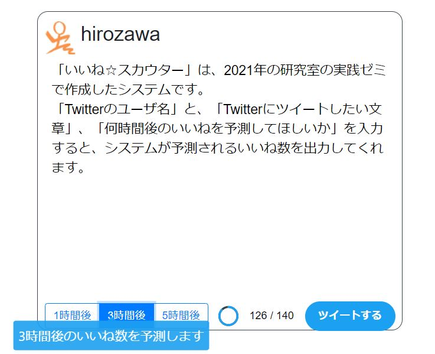

# いいねScouter
2021年の研究室の実践ゼミで作成中の作品です。 
4人で開発しています。 

## * システム概要
 「Twitterのユーザ名」と、「Twitterにツイートしたい文章」、「何時間後のいいねを予測してほしいか」を入力すると、システムが予測されるいいね数を出力してくれます。  

## * システムの流れ
  * ユーザ名入力画面(初期画面)  
      
    以下のようにユーザ名を入力する  
       
    
  * ツイート入力画面  
    ツイートしたい文章を140字以内で入力する。 
       
    
      140字を越えた場合はいいね数予測画面に遷移することができない。 
       
    
  * 予測いいね数出力画面  
    n時間後のいいね数を予測して出力。 
       
    
上記のツイートでは、3時間経っても0いいねであると予測される。  

## * 環境構築
$ pip install mecab-python3  
$ pip install unidic-lite  
$ pip install tweepy==3.10.0  
$ pip install scikit-learn  
$ pip install Flask  
他  

## * 動作環境
python == 3.6.1  
TensorFlow == 2.2.2  
（パッケージcoloramaもインストールする必要があるかもしれません）  
 

## * プログラムについて
  * make_tweet_Dataset.py　(実行は一度で良い)  
    APIキーやACCESS Tokenを登録して(念のためダミーデータを入れているので実行する際は正しいデータに置き換える必要あり)、ツイートをキーワード検索してcsv(test.csv)に格納する。   
  * Get_sentence_feature.py　(実行は一度で良い)  
    ツイート情報(test.csv)内のツイート文章を基に、単語のベクトル化(Word2Vec)とジャンル名予測問題を通じて各文章の特徴量50次元を取得する。  
     各文章特徴量取得後、csvファイル(feature.csv)に格納する。   
  * Concatenate_Dataset.py　(実行は一度で良い)  
    ツイート情報(test.csv)と文章特徴量(feature.csv)を列方向に結合して、csv(Dataset.csv)に格納   
  * AutoEncoder_learning.py　(実行は一度で良い)  
    Dataset.csvのいくつかの情報をAutoEncoderで学習し、ファインチューニングを行い、いいね数を予測する。  
    AutoEncoderとFine tuning学習モデルの重みとデータセットを正規化した時の値を保存しておく必要あり。  
    
  * Good_Scouter_System.py
  　いいねスカウター実装版  
    「該当ユーザ名(@の後の半角英字)」、「何時間後のいいねを予測してほしいか」、「ツイートしたい文章」を入力するといいね数を返してくれる。   

## * 今後の予定
  * ユーザ情報入力後、そのユーザーの直近ツイートといいね数も学習に加える機能の追加
  * ツイート候補文章からキーワードとなる単語を割り出し、そのキーワードに対する直近30分のツイートといいね数も学習に加える機能の追加
  * リツイート数とリプライ数の予測機能
